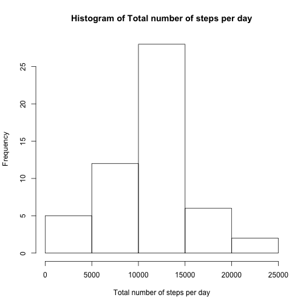
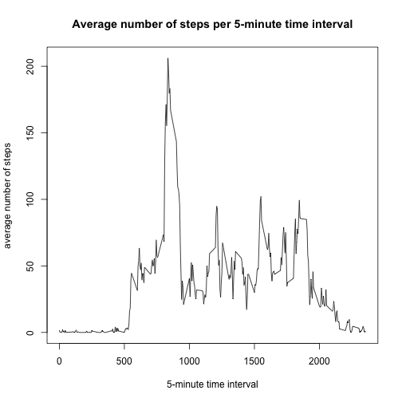
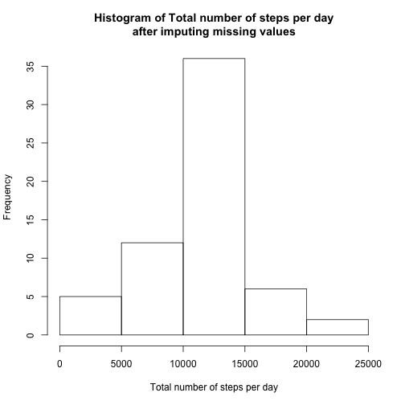
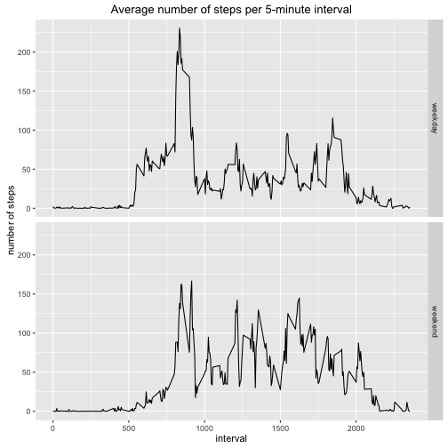

Reproducible Research: Peer Assessment 1
========================================

## Loading and preprocessing the data


```r
    data <- read.csv(unz("activity.zip", "activity.csv"), stringsAsFactors = FALSE)
    data$date <- as.Date(data$date)
    str(data)
```

```
## 'data.frame':	17568 obs. of  3 variables:
##  $ steps   : int  NA NA NA NA NA NA NA NA NA NA ...
##  $ date    : Date, format: "2012-10-01" "2012-10-01" ...
##  $ interval: int  0 5 10 15 20 25 30 35 40 45 ...
```

## What is mean total number of steps taken per day?


```r
    library(dplyr, quietly = TRUE, warn.conflicts = FALSE)
    cleandata <- na.omit(data)
    stepsbyday <- summarize(group_by(cleandata, date), steps = sum(steps))
    hist(stepsbyday$steps,
         xlab = "Total number of steps per day",
         main = "Histogram of Total number of steps per day")
```



```r
    paste("Mean total number of steps per day:   ", mean(stepsbyday$steps))
```

```
## [1] "Mean total number of steps per day:    10766.1886792453"
```

```r
    paste("Median total number of steps per day: ", median(stepsbyday$steps))
```

```
## [1] "Median total number of steps per day:  10765"
```

## What is the average daily activity pattern?


```r
    stepsbyinterval <- summarize(group_by(cleandata, interval), steps = mean(steps))
    plot(stepsbyinterval$interval,
         stepsbyinterval$steps,
         type = "l",
         main = "Average number of steps per 5-minute time interval",
         xlab = "5-minute time interval",
         ylab = "average number of steps")
```



```r
    paste("Highest average number of steps at ",
          stepsbyinterval[which.max(stepsbyinterval$steps), ]$interval)
```

```
## [1] "Highest average number of steps at  835"
```

## Imputing missing values


```r
    paste("Number of missing values: ", sum(!complete.cases(data)))
```

```
## [1] "Number of missing values:  2304"
```
#### As we have several days without any data, we will impute missing data based on the average number of steps for the time interval over the available data


```r
    filldata <- data
    idxna <- is.na(filldata$steps)
    filldata[idxna,"steps"] <-
        stepsbyinterval[match(filldata[idxna,]$interval, stepsbyinterval$interval),"steps"]
    head(filldata)
```

```
##       steps       date interval
## 1 1.7169811 2012-10-01        0
## 2 0.3396226 2012-10-01        5
## 3 0.1320755 2012-10-01       10
## 4 0.1509434 2012-10-01       15
## 5 0.0754717 2012-10-01       20
## 6 2.0943396 2012-10-01       25
```

```r
    stepsbyday <- summarize(group_by(filldata, date), steps = sum(steps))
    hist(stepsbyday$steps,
         xlab = "Total number of steps per day",
         main = "Histogram of Total number of steps per day\nafter imputing missing values")
```



```r
    paste("Mean total number of steps per day:   ", mean(stepsbyday$steps))
```

```
## [1] "Mean total number of steps per day:    10766.1886792453"
```

```r
    paste("Median total number of steps per day: ", median(stepsbyday$steps))
```

```
## [1] "Median total number of steps per day:  10766.1886792453"
```
#### By imputing missing values, we shift the median of the total number of steps per day towards the mean (in this case it's the same value). The mean does not change.

## Are there differences in activity patterns between weekdays and weekends?


```r
    library(ggplot2)
    filldata$daytype <-
        factor(
            ifelse(
                weekdays(filldata$date) %in% c("Saturday","Sunday"),
                "weekend",
                "weekday"
                )
            )
    stepsbyintervaldaytype <-
        summarize(group_by(filldata, interval, daytype), steps = mean(steps))
    qplot(x = interval,
          y= steps,
          data = stepsbyintervaldaytype, 
          facets = daytype ~ ., 
          geom = "line", 
          main = "Average number of steps per 5-minute interval", 
          ylab = "number of steps")
```



#### It's obvious that the activity patterns during weekdays and weekends differ, both in amplitude as in the time range in which higher activity is performed.
